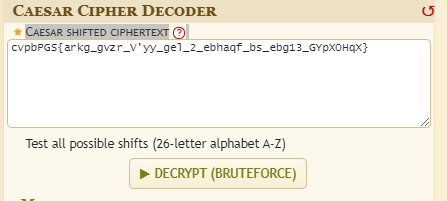

---

* **Mode 26**
  * *Category:*
    * Cryptography
  * *Points:*
    * 10 points
  * *Description:*
    * Cryptography can be easy, do you know what ROT13 is? cvpbPGS{arkg_gvzr_V'yy_gel_2_ebhaqf_bs_ebg13_GYpXOHqX}
  * *Hints:*
    * This can be solved online if you don't want to do it by hand!
  * 
* *Objective:*
  * Decript: cvpbPGS{arkg_gvzr_V'yy_gel_2_ebhaqf_bs_ebg13_GYpXOHqX}
* *Steps:*
  * **Cryptography** is the method of protecting information and communications through the use of code.
  * To solve this flag will have to use a cipher algorithm to perform the decryption.
    * Lets use this [website](https://www.dcode.fr/caesar-cipher) to descript it.
    * Then past cvpbPGS{arkg_gvzr_V'yy_gel_2_ebhaqf_bs_ebg13_GYpXOHqX} at the Caesar shifted ciphertext spaces and click on decrypt.
    * 
    * Then we will get different results on the left side.
    * 
    * From the results, it seems like they use ROT3 to encrypt the flag.
    * ROT13 is a letter substitution cipher that replaces a letter with the 13th letter after it in the alphabet.
      * For example:
      * 
    * Flag: picoCTF{next_time_I'll_try_2_rounds_of_rot13_TLcKBUdK}
    * 
