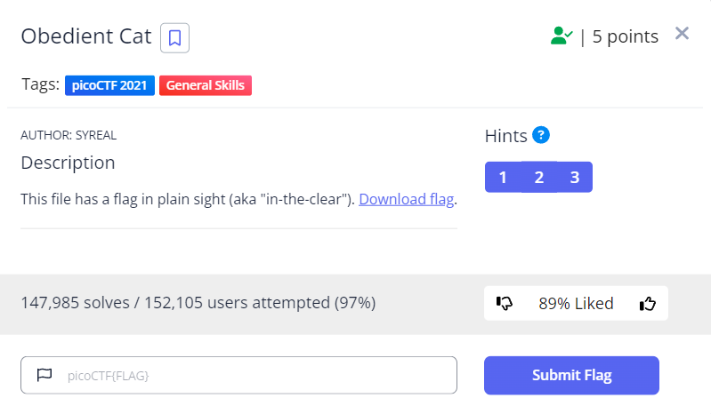
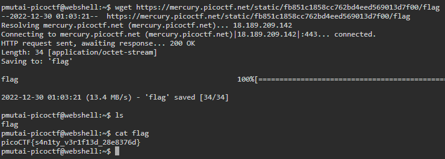
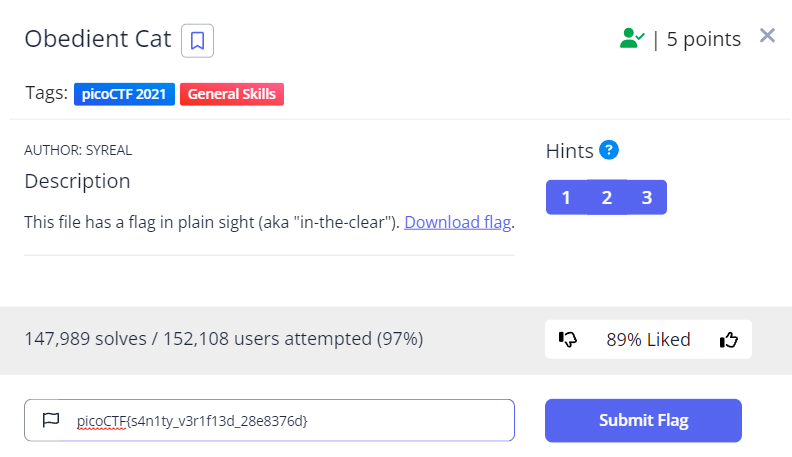

---

          
* **Obedient Cat**
  * 
  * **Objective:**
    * Find the flag inside this [download flag](https://mercury.picoctf.net/static/fb851c1858cc762bd4eed569013d7f00/flag) file.
  * **Steps**
    * Using windows Operating system
      * Download the file and open it with notepad or any other application if you are using a Windows Operating System.
    * Using Linux
      * Use the provided webshell in Pico CTF.
      * Then download the file using Wget {file link}
      * `wget https://mercury.picoctf.net/static/fb851c1858cc762bd4eed569013d7f00/flag`
      * To open the file use cat {file name}
      * `cat flag`
      * Flag: * `picoCTF{s4n1ty_v3r1f13d_28e8376d}` *
      * 
      * 
  
