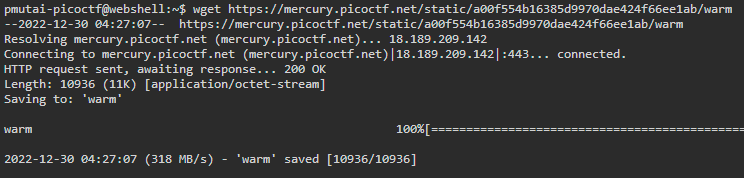
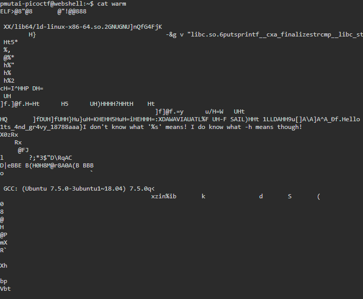
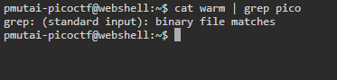
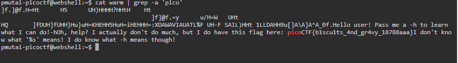
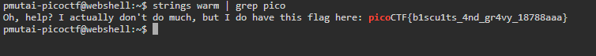

---
* **Wave a flag**
* *Category:*
  * General Skills
* *Points:*
  * 10 Points
* *Description:* 
  * Can you invoke help flags for a tool or binary? [This program](https://mercury.picoctf.net/static/a00f554b16385d9970dae424f66ee1ab/warm) has extraordinarily helpful information... 
* *Hints* 
  * This program will only work in the webshell or another Linux computer.
  * To get the file accessible in your shell, enter the following in the Terminal prompt: $ wget https://mercury.picoctf.net/static/a00f554b16385d9970dae424f66ee1ab/warm
  * Run this program by entering the following in the Terminal prompt: $ ./warm, but you'll first have to make it executable with $ chmod +x warm
  * -h and --help are the most common arguments to give to programs to get more information from them!
  * Not every program implements help features like -h and --help.
* 
* *Objective:*  
  * Find the flag inside the provided flag.
* *Steps:*
  * We first need to download the provided file and open it in webshell that PicoCTF provided.
  * To download run wget{url file link}.
  * 
  * Then open it with cat{file name}
  * 
  * The file seems to have random numbers and letters when we tried to open it.
  * We can try to open the file and search for the word **pico** and see if that works. 
  * `cat warm | grep pico` 
    * *grep* is a command-line utility that searches for plain text in a file.
  * 
  * We were not able to get the result because we can not use grep without any options to search a binary file, however, we can use **grep** and **-a** option to search the file. 
    * **-a** will process a binary file as if it were a text.
    * If you need to know more about **grep**, run **man grep** in your terminal.
  * `cat warm | grep -a 'pico'`
  * 
  * Also We can also use command **strings** and **grep** to search pico and it's one of the easiest ways to solve this challenge.
    * ** strings** is a command-line utility used to return string characters from a file.
  * `strings | grep pico` 
  * 
  * Flag: *picoCTF{b1scu1ts_4nd_gr4vy_18788aaa}*
  * 